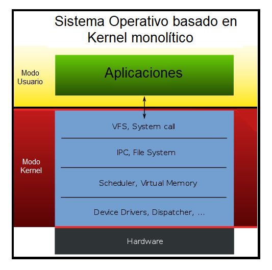
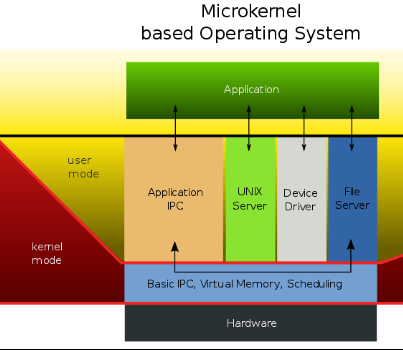

Actividad 1
====================
- [Núcleos monolíticos](#1.0)
- [Micro Núcleo](#2.0)
- [Núcleo híbrido](#3.0)
- [Modo User vs Modo Kernel](#4.0)
- [Trap vs Interrupción](#5.0)

## 1.0 Núcleos monolíticos
Estos sistemas tienen un nucelo grande y complejo, que contiene o engloba todos los servicios del sistema. Está programado de forma no modular, y por lo tanto, 
tiene un mayor rendimiento mayor que un micronúcleo. Sin embargo, cualquier cambio a realizar en cualquier servicio requiere la recompilación del núcleo y el reinicio del sistema para aplicar los nuevos cambios.

## 2.0 Micro Núcleo 
Realizan unicamente necesidades más básicas del sistema operativo. Las demás funcionalidades son añadidas mediante la adicion o agregacion de los modulos externos al núcleo, lo que les proporciona flexibilidad y facilidad de ampliación. Son más seguros que los Monolíticos.

### Ventajas de un micro núcleo
- Portabilidad
- Poco almacenamiento
- Seguridad: Si algun modulo falla no se ve afectado todo el kernel.

### Desventajas
- Los procesos tienen que esperar en una cola para obtener información.
- Los procesos no pueden tener acceso a otros procesos sin tener que esperar.

## 3.0 Núcleo híbrido 
Es la mezcla de un micronúcleo y un kernel monolítico. Estos por lo general contienen codigo extra para aumentar el rendimiento. A diferencia de los núcleos monolíticos tradicionales, los controladores pueden ser detenidos momentáneamente por actividades más importantes bajo ciertas condiciones.

## 4.0 Modo User vs Modo Kernel
### Modo User
Cuando un programa en modo usuario desea ejecutarse, el sistema operatvio crea un proceso y un espacio de direcciones virtuales. Los programas en modo usuario tienen menos privilegios y no se les permite acceder directamente a los recursos del sistema, tendrá que pasar primeramente por el kernel.

### Modo kernel
Este administra la interaccion entre el hardware y software. Es el programa más privilegiado.

Al ejecutarse una aplicacion este solicita algun proceso, por lo que, primero debe pasar por el kernel, entonces el procesador cambia al modo kernel y luego vuelve a cambiar al modo usuario.

## 5.0 Trap vs Interrupción
- El trap es una señal emitida por un programa de usuario que indica al sistema operativo que realice alguna funcionalidad de inmediato.

- La interrupción es una señal a la CPU emitida por el hardware que indica un evento que requiere atención inmediata.

- El trap es un proceso sincrónico.

- La interrupción un proceso asincrónico.

- Todas las traps son interrpciones.

- Todas las interrupciones son traps.

- Un trap la genera un programa de usuario.

- Las interrupciones las generan los dispositivos de hardware