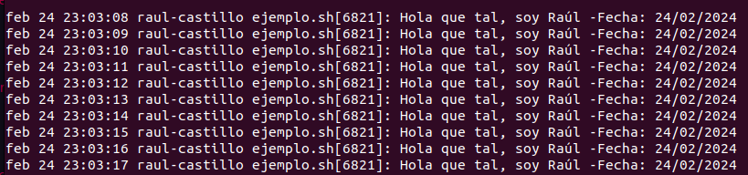

## 1 Crear un archivo .sh
```bash
#!/bin/bash

while true;do
echo "Hola que tal, soy Raúl -Fecha: $(date +"%d/%m/%Y")"
sleep 1
done
```

## 2 Brindar permisos de ejecución
```bash
chmod +x archivo.sh
```

## 3 Crear archivo .service 
```
[Unit]
Description=Daemon myservice

[Service]
User=root
ExecStart=/home/raul/Documentos/ejemplo.sh
Restart=always

[Install]
WantedBy=multi-user.target

```

## 3 Habilitar el servicio
```bash
sudo systemctl enable saludo.service
```

## 4 Iniciar el servicio
```bash
sudo systemctl start uso-memoria.service
```

## 5 Observar logs
```bash
sudo systemctl status saludo.service
```
