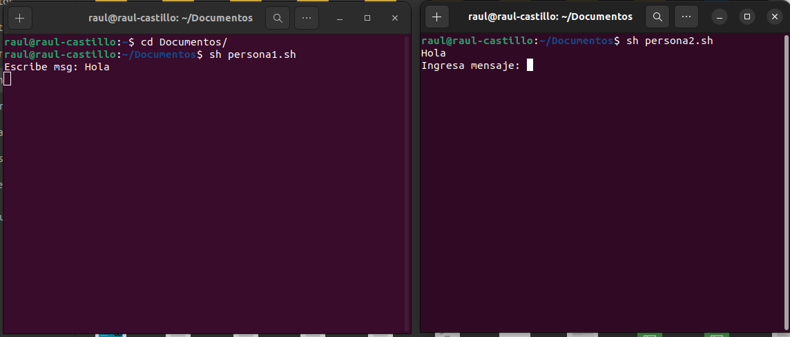
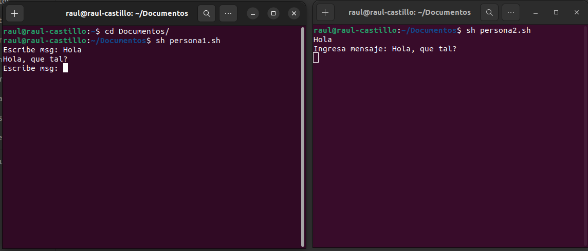
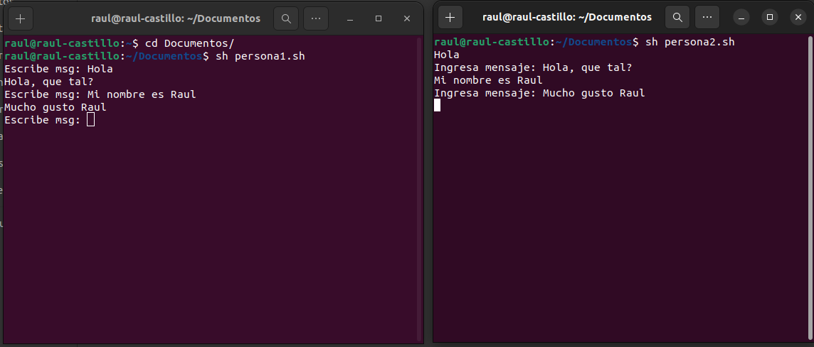

## Named Pipes 202001932

### Crear un named pipes
```bash
mkfifo mipipe
```

### Crear 2 scripts, uno para persona 1 y otro para persona 2
#### Script person1
``` bash
#!/bin/bash
while true; do
	read -p "Escribe msg: " msg
	echo $msg > mipipe
	cat mipipe
done
```

#### Script person2
``` bash
#!/bin/bash
while true; do
	cat mipipe
	read -p "Ingresa mensaje: " msg 
	echo $msg > mipipe
done
```

### Resultado



