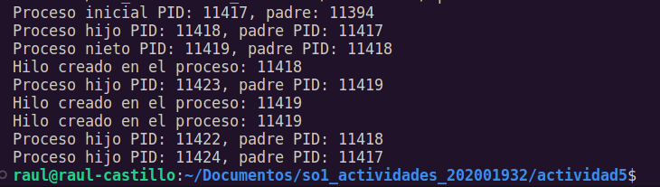

# Actividad 5

### ¿Cuántos procesos unicos fueron creados?
Tomando en cuenta el proceso principal, es decir el proceso del codigo inicial del código en C, fueron creados 6 procesos.

### ¿Cuántos hilos únicos fueron creados?
El total de hilos o threads creados fueron 3. De igual manera observando el grafico de bifurcaciones se observan 3 procesos hijos creados y ejecutando cada uno de los hilos.

